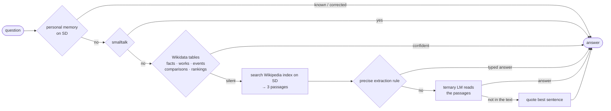

# Tiny-LLM DE

**An offline German question-answering assistant designed for the ESP32-S3 microcontroller —
8 MiB flash, 8 MiB PSRAM and a 32 GB microSD card, no internet.**

A few megabytes of weights cannot hold world knowledge. So this project puts the
knowledge on the SD card — a Wikipedia search index and Wikidata tables — and
trains a small ternary language model to *read* rather than to *know*. The device
also learns from its owner: facts you tell it and corrections you make are
stored on the card and used from the next question on.

> **Status:** research prototype. Everything here runs as a Python reference on a
> desktop and is measured there. The data formats and memory budgets are designed
> for the ESP32-S3, but the C/C++ firmware has not been written yet.

---

## How it answers a question



Every stage is allowed to stay silent. A stage only answers when it is confident;
a wrong answer that *looks* like a fact is treated as worse than no answer.

## Results

Measured with strict scoring (the expected answer must appear as whole words).
MKQA and Mintaka are **independent** public test sets that were never used for
development — all tuning happened on separate `*_dev` splits.

| Test set | Questions | Answered correctly | Invented answers |
|---|---:|---:|---:|
| [MKQA](https://github.com/apple/ml-mkqa) (German, real search queries) | 500 | 8.6 % | 0.2 % |
| [Mintaka](https://github.com/amazon-science/mintaka) (German; comparisons, superlatives, multi-hop) | 500 | 11.8 – 12.8 % | 2.4 % |
| own natural everyday questions | 195 | 58.5 % | 0 % |
| hand-written questions | 60 | 66.7 % | 0 % |

The gap between the sets is real, not noise: MKQA is heavily about US pop culture
and sports, while the own sets are everyday German knowledge. On MKQA the search
finds the answer in the top-3 passages only about 20 % of the time — **retrieval
is the main open bottleneck.** See [docs/results.md](docs/results.md) for the full
measurement history, including the ideas that failed.

What moved the needle most:

| Change | Effect |
|---|---|
| Wikidata tables instead of a bigger text index (the Wikipedia dump lacks infoboxes) | own questions 30.8 → 50.3 % (lenient scoring at the time) |
| Index built by article popularity instead of file order | MKQA-dev 5.0 → 7.8 %, Mintaka-dev 7.4 → 11.2 % |
| Staying silent unless every word of the question is explained | table precision 30 → 86 % on Mintaka-dev |
| Reading training on *real* questions in the exact chain format | invented answers 18.6 → 2.4 % (Mintaka-dev) |
| Refusal examples ("not in the text") in fine-tuning | invented answers 45 → 1.5 % (templated questions, earlier model) |

## Fitting the ESP32-S3

| | Where | Size |
|---|---|---|
| Ternary transformer core (22 layers × 352, 11 heads, 1 KV head, 32.4 M params) | flash (memory-mapped) + PSRAM | ≈ 9.9 MiB packed: 8.0 MiB flash + ≈ 3 MiB PSRAM |
| Per-layer embedding table (46 M params) | SD card, 5.6 KB read per token | 46 MB |
| Wikipedia search index (1 M articles, 2.3 M passages) | SD card | 1.2 GB |
| Wikidata tables (facts, works, rankings) | SD card, sorted files | ≈ 1 GB |
| Personal memory (append-only log) | SD card | a few KB |

Search reads ≈ 160 KB of posting lists plus 200 short passages per question —
an estimated 0.3 s on SPI SD. Details in [docs/architecture.md](docs/architecture.md).

## Learning from conversations

The device does not update its weights (training needs full-precision shadow
weights — far more than 8 MiB). Instead it keeps an append-only memory on the SD
card that is used from the very next question:

```text
You:    Merk dir: Mein Hund heißt Bello.        (remember: my dog is called Bello)
Device: Okay, gemerkt: „Mein Hund heißt Bello.“
You:    Wie heißt mein Hund?                      (what is my dog's name?)
Device: Das hast du mir erzählt: „Mein Hund heißt Bello.“
You:    Wie lang ist die Weser?                   (how long is the Weser?)
Device: 451 Kilometer
You:    Falsch, richtig ist 452 Kilometer.        (wrong, it is 452 km)
Device: Danke, ich habe es korrigiert: 452 Kilometer.
                                                  — the correction now wins over Wikidata
You:    Vergiss meinen Hund.                      (forget my dog)
                                                  — the line is really removed from the card
```

See [`esp32_sd/memory.py`](esp32_sd/memory.py) and its tests.

## Repository layout

```
knowledge/     the knowledge side: SD search index, Wikidata stages, extraction rules
lm/            the language model: architecture, ternary weights, quantization, inference
training/      pretraining, fine-tuning, tokenizer and training-data builders
evaluation/    run the whole chain, build external test sets, per-stage precision tools
  questions/   all question sets used for measurement
esp32_sd/      device reference: SD index format, chat, personal memory, tests
speech/        experimental speech recognition and speech output
scripts/       data fetching (Wikidata via QLever) and training recipes
tokenizer/     the German byte-level BPE tokenizer (8192 tokens)
docs/          architecture, results, reproduction
```

A description of every file is in [docs/architecture.md](docs/architecture.md#file-by-file).

## Quick start

```bash
python -m venv .venv && source .venv/bin/activate
pip install -r requirements.txt

# unit tests of the device reference (no data needed)
python -m unittest esp32_sd.test_chat esp32_sd.test_memory esp32_sd.test_sd_index \
    esp32_sd.test_smalltalk esp32_sd.test_extractive_answer esp32_sd.test_model_manifest
```

Datasets, indexes and model checkpoints are **not** in the repository (together
over 60 GB). [docs/reproduce.md](docs/reproduce.md) rebuilds them step by step.
With the data in place:

```bash
python -m esp32_sd.chat                                  # talk to the device reference
python -m evaluation.run_chain --fragen evaluation/questions/mkqa_dev.json \
    --regeln2 --fakten --absaetze 3 --zeichen 1500       # measure the chain
```

Run everything from the repository root with `python -m package.module`.

## A note on language

The assistant speaks German, and the project was developed in German: code
comments, docstrings and command-line flags (`--fragen` = questions,
`--absaetze` = passages, `--fakten` = facts) are German. The documentation is in
English, and [docs/architecture.md](docs/architecture.md#file-by-file) explains
every file in English.

## Data sources and licenses

| Source | License | Used for |
|---|---|---|
| German Wikipedia via [`wikimedia/wikipedia`](https://huggingface.co/datasets/wikimedia/wikipedia) | CC BY-SA 4.0 | search index, reading examples |
| [Wikidata](https://www.wikidata.org) via [QLever](https://qlever.dev) | CC0 | fact, work and ranking tables |
| [MKQA](https://github.com/apple/ml-mkqa) (Apple) | CC BY-SA 3.0 | `evaluation/questions/mkqa*.json` are derived from it and share its license |
| [Mintaka](https://github.com/amazon-science/mintaka) (Amazon) | CC BY 4.0 | `evaluation/questions/mintaka*.json` are derived from it |
| [GermanQuAD](https://www.deepset.ai/germanquad) (deepset) | CC BY 4.0 | reading training data (not included) |

`evaluation/questions/templated1000.json` contains excerpts of Wikipedia
paragraphs (CC BY-SA 4.0).

No license has been chosen for the code yet.
